# 	1、Redis安装、配置和启动

==阳哥邮箱：zzyybs@126.com==


在官网下载tar.gz包后，拷贝到/opt中，进行解压，然后进入解压出的redis文件中，执行命令make && make install,默认安装到/usr/local/bin目录下

在根目录下创建一个目录/myredis，并将/opt/redis-7.0.10/redis.conf文件复制到myredis目录下，保留原文件

配置文件的修改：

​	1.将daemonize no 改为 daemonize yes

​	2.protected-mode yes 改为protected-mode no

​	3.注释掉bind 127.0.0.1 -::1

​	4.requirepass设置密码

主从复制的配置：


redis可使用config get xxx 来查看对应的配置


redis卸载：rm -rf /usr/local/bin/redis-*

启动：

​	redis-server /myredis/redis7.conf

​	redis-cli -a 密码 [-p 6379] [--raw]

​			redis-cli  --> auth 密码

​	可使用ps -ef | grep redis | grep -v grep 查看进程

​	若输入ping，输出PONG，则启动成功

退出cli：quit

退出cli和server：

​	在redis命令行中：shutdown

​	不在redis命令行中（远程关闭）：单实例关闭：redis -cli -a 密码 shutdown

​																多实例关闭（分别指定端口号）：redis-cli -p 6379 shutdown

# 2、Redis十大数据类型

## 2.1 总体概述


## 2.2 获取redis常见数据类型操作命令

官网英文：[Commands | Redis](https://redis.io/commands/)

中文：[Redis命令中心（Redis commands） -- Redis中国用户组（CRUG）](http://redis.cn/commands.html)

## 2.3 key操作命令


**获取对应数据类型的命令：help @数据类型**

**redis可使用config get xxx 来查看对应的配置**

**命令不区分大小写，但是key使区分的**

## 2.4.1 String


**若msetnx k1 v1 k2 v2：k1已经存在，k4不存在，则不会执行成功，全部都失败**


**setnx == set nx的合并**

**setex == set + expire 的合并 == set ex**


**getset k v == set k v get**


**string应用场景：点赞，访问次数**


## 2.4.2 List


**lrange list1 0 -1 相当于遍历**


**应用场景：微信公众号多关注订阅的文章**


## 2.4.3 Hash


**现版本hset == hmset，hmset已经被弃用**


**hgetall相当于遍历**


## 2.4.4 Set（无序且不重复）

***


**smembers key 相当于遍历**


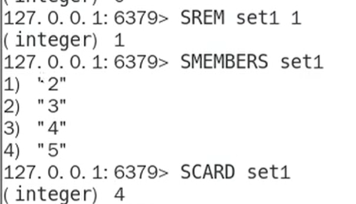


***


## 2.4.5 Zset(sorted set)


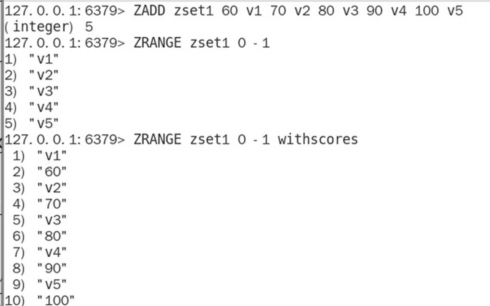


## 2.4.6 bitmap（位图）--string


**bitmap 相当于string的子类，type bit 的返回值为string**


**每八位一组，一组是一个字节，strlen返回的是字节数**


**签到天数**


## 2.4.7 HyperLogLog（基数统计）--string


## 2.4.8 GEO（地理空间）--zset


## 2.4.9 Stream（redis流）用于MQ


### 生产相关命令


### 消费相关命令


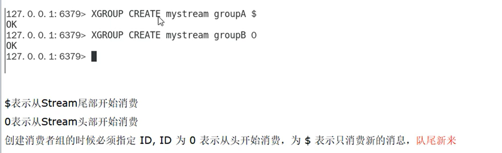


## 2.4.10 bitfield（位域）


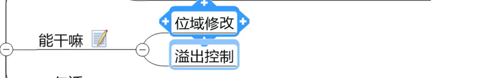


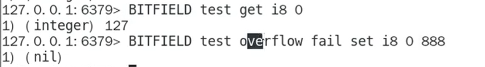


# 3、Redis持久化


## ==3.1 RDB（Redis Database）==

### 是什么（含6 7 自动触发区别）


### 自动触发


**按上图修改配置**

save 5 2（现在已经设置为5秒两次）

dir /myredis/dumpfiles

dbfilename dump6379.rdb


**执行shutdown命令且没有开启AOF持久化也会生成dump文件**


### 手动触发（默认推荐使用DBSAVE，因为不会阻塞redis服务器）


**严禁使用save手动触发！！！**


### 优缺点


### 修复RDB文件

使用在/usr/local/bin目录下的check-rdb，修复rdb文件


### RDB触发情况和快照禁用


**将save后写成空串，但还是可以手动触发生成rdb文件**


### redis数据库RDB和AOF配置，数据库备份的区别：

**一句话：AOF的优先级高于RDB**

**情况1：整个redis默认情况下，redis为不设置save参数且未开启了AOF持久化时，当shutdown时会生成一个有效dump文件，整个过程只能在shutdown时保存一个有效的dump文件，以至于下一次打开redis时可恢复数据**

**情况2：不设置save参数但是开启了AOF持久化时，以AOF为主，当shutdown时也会生成一个无效dump文件，备份数据库由AOF完成，若将AOF文件删除，数据库将无法完成备份**

**情况3：但是若将save 后写成空串，则是禁用所有dump文件的自动生成方式，shutdown时连空文件也不会生成，若开启了AOF，则可由AOF完成备份，若未开启AOF，则是纯缓存模式，则redis无法自动完成备份**

**情况4：设置了save参数以开启自动触发RDB，若未开启AOF，则由RDB独自完成备份，若开启了AOF且开启了混合模式，则由RDB和AOF混合完成备份，生成的AOF文件包括RDB头部和AOF混写，若未开启混合模式，则以AOF为主，AOF优先级高**


### 优化配置项（后四者都推荐默认）


**若为yes，则数据一致性很高（建议默认yes）**


**推荐默认yes**


**推荐默认yes**


**推荐默认no**


### 小总结


## ==3.2 AOF（Append Only File）==

### 是什么


**默认为关闭，可通过yes开启**


### AOF持久工作流程和三种写回策略（默认为everysec）


**先保存在AOF缓存区，等达到一定数量后再写入AOF文件，减少IO次数**


### 配置开启（含6 7aof保存路径、保存名称的区别）


++++


++++


**redis6：和RDB保存的位置相同**

**==redis7：会在RAB文件保存的位置上加上一个自己设定的appenddirname目录，保存在其中==**


++++


**redis6：只有一个aof文件**

**==redis7：aof文件被拆分为三个==**


### 正常恢复


**不看rdb文件，把rdb文件全部删掉，可以证明只用aof文件也可以对redis数据库进行恢复**

**对于写操作，==是aof.incr在默默记录==，对于读操作，不会记录，大小不变**


### 异常恢复


**在aof.incr文件中故意写入乱码：**

****

**redis服务器启动不了**

**使用/usr/local/bin目录下的==redis-check-aof --fix==修复incr文件**


### 优缺点


### 重写机制


**当aof文件达到阈值时，自动触发**

**使用bgrewriteaof手动触发**


案例：


### 小总结


## 3.3 RDB-AOF混合持久化


**可以共存，但AOF优先级高于RDB**


### redis数据库RDB和AOF配置，数据库备份的区别：

==**一句话：AOF的优先级高于RDB==**

**情况1：整个redis默认情况下，redis为不设置save参数且未开启了AOF持久化时，当shutdown时会生成一个有效dump文件，整个过程只能在shutdown时保存一个有效的dump文件，以至于下一次打开redis时可恢复数据**

**情况2：不设置save参数但是开启了AOF持久化时，以AOF为主，当shutdown时也会生成一个无效dump文件，备份数据库由AOF完成，若将AOF文件删除，数据库将无法完成备份**

**情况3：但是若将save 后写成空串，则是禁用所有dump文件的自动生成方式，shutdown时连空文件也不会生成，若开启了AOF，则可由AOF完成备份，若未开启AOF，则是纯缓存模式，则redis无法自动完成备份**

**情况4：设置了save参数以开启自动触发RDB，若未开启AOF，则由RDB独自完成备份，若开启了AOF且开启了混合模式，则由RDB和AOF混合完成备份，生成的AOF文件包括RDB头部和AOF混写，若未开启混合模式，则以AOF为主，AOF优先级高**


## 3.4 纯缓存模式


**不影响手动备份！！！！！！！！！！！！！！！！**


# ==4、Redis事务==


## 4.1 Redis事务是什么，与数据库事务的对比

**==数据库事务：在一次跟数据库的连接会话当中，所有执行的SQL，要么一起成功，要么一起失败==**

**==原子性：一个事务中的所有操作要么全部成功，要么全部失败回滚，不能只执行其中的一部分操作==**


**Redis的事务只是能够==保证一组命令能够连续独占的执行，不会被其他命令插入，也不会被阻塞==，事务提交前任何命令都==不会被实际执行，即不涉及数据库事务的回滚操作，所以没有隔离级别，不保证原子性==(即不保证同时成功或同时失败，冤头债主)，只决定是否开始执行一组的全部指令**


## 4.2 怎么使用Redis事务


### 常用命令


### 正常执行


### 放弃执行


### 全体连坐（语法编译错误，该组命令全部被舍弃）


### 冤头债主（语法没错，编译时没检查出错误，对的命令执行，不对的不执行）


### watch监控（开启乐观锁）


**==Redis采用乐观锁，但必须要提交的版本大于当前版本才能执行==**

**watch key时，若其他客户端已对key进行修改，当前事务将会被打断，无效**


### unwatch


### 小总结


# 5、Redis管道


## 5.1 管道的由来，是什么


## ==5.2 管道的操作==


**在Linux窗口下，写好一个txt文件，用管道符执行该文件中的所有命令**


## 5.3 管道与原生批处理命令和事务的对比，使用注意事项


pipeline与原生批处理命令对比：


pipeline与事务对比：


使用pipeline注意事项：


# 6、Redis发布订阅（了解即可）


## 6.1 是什么


是stream的前身

## 6.2 能干嘛

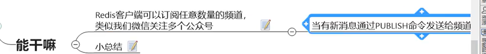


## 6.3 常用命令


**演示：**


**psubscribe是订阅带有通配符*的频道**


**小总结：**


# 7、Redis主从复制


## 7.1 是什么、能干嘛


**==master以写为主，slave以读为主==**


## 7.2 操作与操作命令


权限细节：

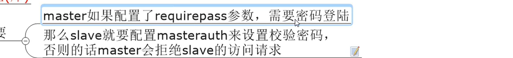

**==从机要设置masterauth来获得主机的许可==**


**手动给自己临时换一个主机**


## ==7.3 实操案例演示==


### 准备工作


**==配主不配从==**


### 配置细节


**==主机只配前十步，从机需要配第十一步==**

从机配置replicaof和masterauth


dump文件名为dump6379.rdb

log文件名为6379.log


### ==一主二仆实现==

#### 配置文件写死情况


**==先开主机，再开从机==**

**==从机启动时，一定要指明端口，否则默认为6379==**


主机日志


备机日志

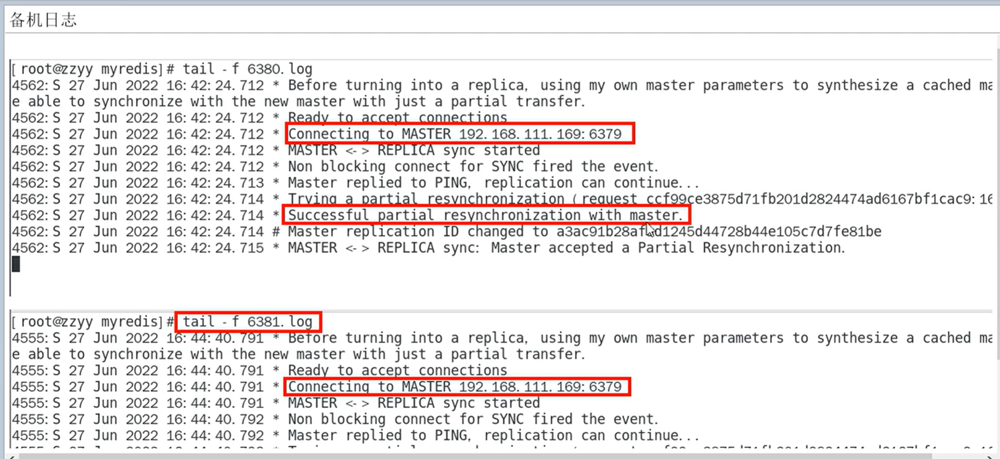


**使用info  replication命令查看主从关系**


#### 主从问题演示（配置写死）


**==从机不可以执行写命令，读写分离==**


**==可以跟上，首次开机全部复制==**


**==主机shutdown过后，从机原地待命==**


**==关系依旧==**


**==和问题2一样，可以跟上==**


#### 命令操作手动指定情况


**==从机重启过后，关系不在了==**


### 薪火相传实现

***


**==slave6380还是不能写操作==**


### 反客为主实现


## ==7.4 复制原理和工作流程总结==


**首次连接，全量复制：**


## 7.5 主从复制缺点


引入哨兵和集群进行改进


# 8、Redis哨兵监控


## 8.1 是什么、能干嘛

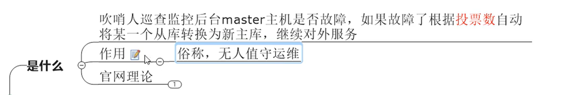


## ==8.2 操作与案例==


### 准备工作

**Redis Sentinel架构，前提说明**


**至少需要三台哨兵，因为网络抖动等等原因，可能造成哨兵down机，并且需要多台哨兵进行投票选取新的master**


### 配置细节


黑字和之前的一样配置


**==quorum参数：法定票数==**


**==至少要有quorum个sentinel认为master有故障，才会进行下线和故障转移==**


**设置哨兵连接master的密码**


其他参数：（用默认即可）


### 本次案例sentinel 文件通用配置


**将三个sentinel端口.conf配置文件如下格式写好**


自己的：

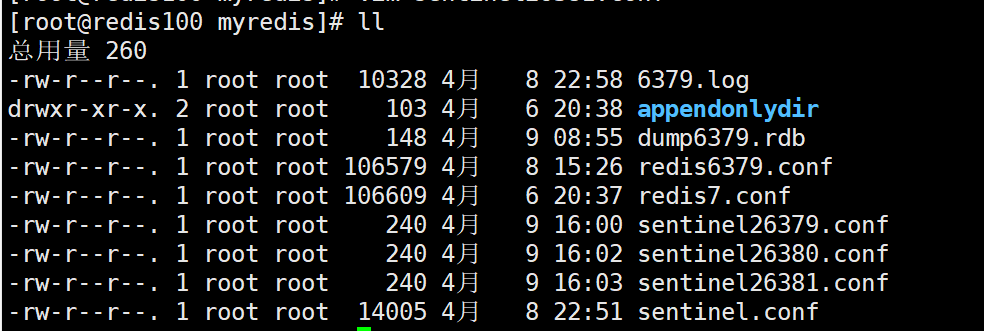


### 哨兵集群启动

#### 一主二从启动


**==从机启动时，一定要指明端口，否则默认为6379==**


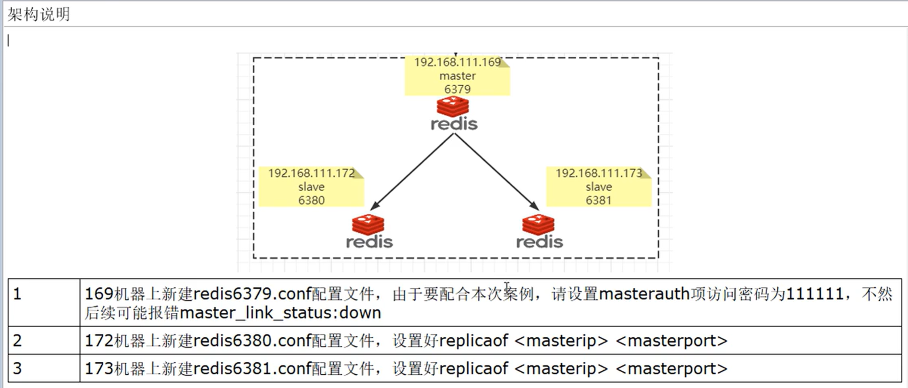

**==前面主从复制的时候，master的redis6379.conf不用设置masterauth，但是这里要设置新主机的密码，因为此时主机可能变从机，推荐所有密码都设为一致，避免报错==**


#### 哨兵启动


**==在同一个终端下启动三个哨兵（实际应用都是一台主机一个哨兵）==**


==sentinel日志文件：==


**==哨兵启动后，会在各自的sentinel.conf配置文件中自动追加重写一些信息，与其生成的log文件相对应==**

例如自己的id，监控的master是谁，slave有哪些，哨兵集群中其他的哨兵是谁


### master挂了，含问题思考


**==1、从机数据OK，只是要等sentinel进行投票选举，master刚挂时可能会提醒断开连接==**

**==2、会从剩下的两台机器上选出新的master==**

**==3、重启后，将会变成slave，6379下位后，会自动向其redis6379.conf最后追加重写一些内容==**


### ==master挂后配置文件的改变==


**==哨兵启动后，会在各自的sentinel.conf配置文件中自动追加重写一些信息，与其生成的log文件相对应==**

例如自己的id，监控的master是谁，slave有哪些，哨兵集群中其他的哨兵是谁


**==6379下位后开机，会自动向其redis6379.conf最后追加重写一些内容==**


**==主从切换后，之前哨兵启动时往sentinel追加的信息也会相应的发生该变，因为主从关系变了==**


## ==8.3 哨兵故障转移运行流程==


**==建议sentinel采取奇数台，防止某一台sentinel无法连接到master导致误切换==**


### Sdown主观下线


### Odown客观下线


### Raft算法选举出领导者哨兵（兵王）


**简单了解Raft算法**


### ==兵王选出新master（含选举算法）==


**新主登基**


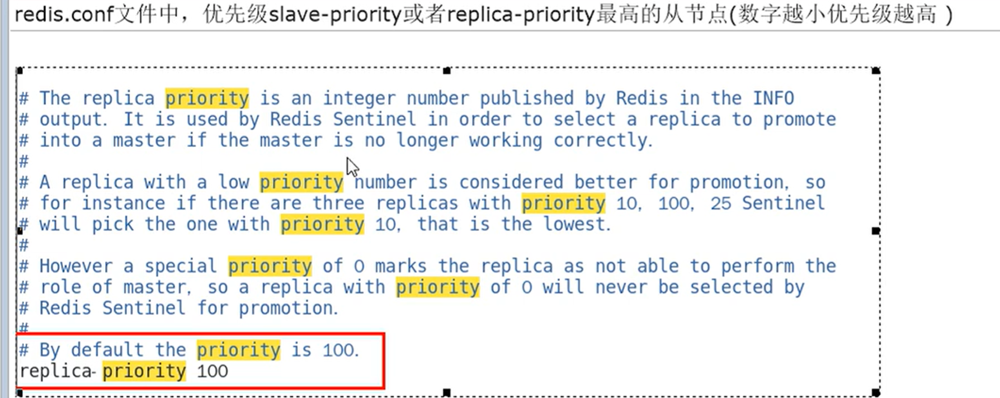

**==选举算发：优先级--> offset--> RunID==**


**群臣俯首**


**旧主拜服**


**小总结**


## 8.4 哨兵使用建议与缺点


**==建议sentinel采取奇数台，防止某一台sentinel无法连接到master导致误切换==**

**主从 + 哨兵也不能保证数据零丢失，所以引出集群**


# ==9、Redis集群分片==


## 9.1 是什么、能干嘛


**==不用再使用哨兵，只需链接任意一个集群中的可用2节点即可，master之间数据共享，但是不保证强一致性==**


## ==9.2 集群算法-分片-槽位slot==


**==被分为16384个槽，有效设置了16384个主节点的集群大小上限，但是建议最大节点大小约为1000个节点==**


### 槽位slot


### 分片和它的优势


### 槽位映射算法


#### 哈希取余分区


#### 一致性哈希算法分区


**算法构建一致性哈希环**


**服务器IP节点映射**

节点：redis服务器


**key落到服务器的落键规则**


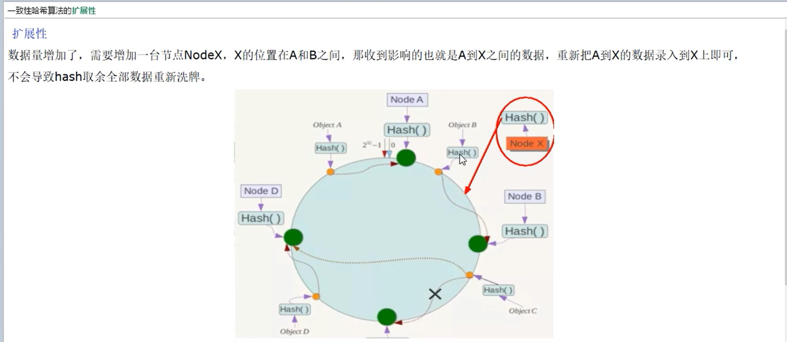


#### ==哈希槽分区==


### ==为什么最大槽数是16384==


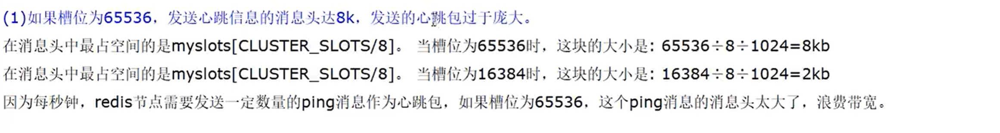

**==（1）65536消息头太大==**


**==（2）1000以内节点16384个槽够用了，不易造成网络拥堵==**


**==（3）在节点少的情况下，即小型集群中，因为填充率为slots/N，若采用65536的话，填充率将会很高，压缩比将会很低，不容易传输，但是采用16384的话，填充率低一些，压缩比将会高很多，容易传输些==**


### 不保证强一致性


## ==9.3 三主三从集群搭建==


### ==3主3从redis集群配置==


#### 新建6台独立的redis实例服务


 


**==相比主从复制，只写了masterauth，没有写replicaof==**

bind 0.0.0.0
daemonize yes
protected-mode no
port 6381
logfile "/myredis/cluster/cluster6381.log"
pidfile /myredis/cluster6381.pid
dir /myredis/cluster
dbfilename dump6381.rdb
appendonly yes
appendfilename "appendonly6381.aof"
requirepass xxxxxxxxxxxxxx@
masterauth xxxxxxxxxxxxxx@
cluster-enabled yes
cluster-config-file nodes-6381.conf
cluster-node-timeout 5000


**==这里只需启动redis-server==**


####  redis-cli为6台机器构建集群关系


**==redis-cli语句如下==**，并没有打开客户端，只是构建了集群

```
redis-cli -a 111111 --cluster create --cluster-replicas 1 192.168.111.185:6381 192.168.111.185:6382 192.168.111.172:6383 192.168.111.172:6384 192.168.111.184:6385 192.168.111.184:6386
```


**==主从关系是随机分配的==**


**集群启动后会产生nodes开头的文件**


#### redis-cli打开6381客户端为切入点，查看并检验集群的状态


**==再使用redis-cli打开6381的客服端，记得指明端口==**


**==根据下面的读写测试，这里加一个-c，表示路由==**

```
redis-cli -a 111111 -p 6381 -c
```


**可以使用==info replication==和==cluster ndoes== 命令来查看**


### 3主3从集群读写


```
redis-cli -a 111111 -p 6381 -c
```


```
cluster keyslot k1
```


### 主从容错切换迁移案例(即一个master宕机)、不保证强一致性、节点从属调整(手动恢复6381master身份)


**容错切换迁移**


**==master宕机后，其真实从机上位==**

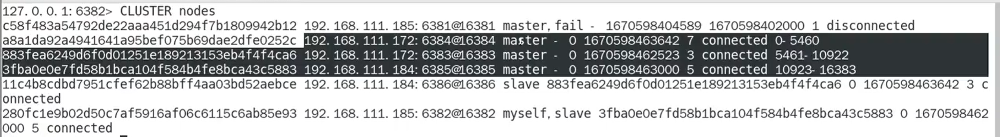


**==6381变成slave==**


**redis集群不保证强一致性**


**手动故障转移（节点从属调整：恢复6381master身份）**


```
cluster failover
```


### ==主从扩容==


**主从扩容全部命令总结：**

```shell
redis-server /myredis/cluster/redisCluster6387.conf		#启动6387server

redis-server /myredis/cluster/redisCluster6388.conf		#启动6388server

redis-cli -a 111111 --cluster add-node 192.168.111.100:6387 192.168.111.100:6381	
#将6387作为新的master加入集群，6381为引荐人

redis-cli -a 111111 --cluster check 192.168.111.100:6381	#第一次检查

redis-cli -a 111111 --cluster reshard 192.168.111.100:6381		#给6387分配slot

redis-cli -a 111111 --cluster check 192.168.111.100:6381		#第二次检查

redis-cli -a 111111 --cluster add-node 192.168.111.100:6388 192.168.111.100:6387 --cluster-slave --cluster-master-id xxxxxxxxxxxxxxxxxxxxx(6387id)
#让6388成为6387的从节点

redis-cli -a 111111 --cluster check 192.168.111.100:6381		#第三c
```


**==redis-cli -a 111111 --cluster add-node 192.168.111.100:6387 192.168.111.100:6381==**


**==redis-cli -a 111111 --cluster check 192.168.111.100:6381==**


**==redis-cli -a 111111 --cluster reshard 192.168.111.100:6381==**

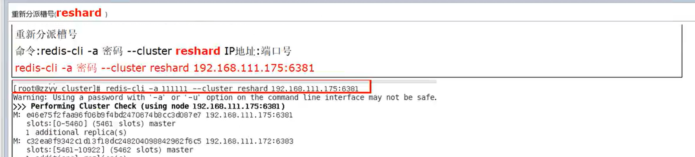

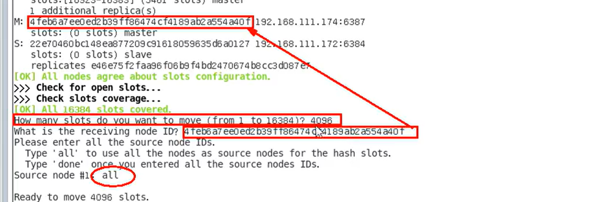


**==6387的slot槽是从其他三家匀过来的==**


**==redis-cli -a 111111 --cluster check 192.168.111.100:6381==**


**==redis-cli -a 111111 --cluster add-node 192.168.111.100:6388 192.168.111.100:6387 --cluster-slave --cluster-master-id xxxxxxxxxxxxxxxxx(6387的id)==**

**==redis-cli -a 111111 --cluster add-node 192.168.111.100:6387 192.168.111.100:6381==**


**==redis-cli -a 111111 --cluster check 192.168.111.100:6381==**


### ==主从缩容==


**主从缩容全部命令总结：**

```shell
redis-cli -a 111111 --cluster check 192.168.111.100:6388	#获得6388的ID
redis-cli -a 111111 --cluster del-node 192.168.111.100:6388 xxxxxxxx(6388id)  #删除6388
redis-cli -a 111111 --cluster reshard 192.168.111.100:6381    #把6387的slot都给6381
redis-cli -a 111111 --cluster check 192.168.111.100:6381    #第二次检查
redis-cli -a 111111 --cluster del-node 192.168.111.100:6387 xxxxxxxx(6387id)  #删除6387
redis-cli -a 111111 --cluster check 192.168.111.100:6381	#第三次检查
```


```
redis-cli -a 111111 --cluster check 192.168.111.100:6388
```


```
redis-cli -a 111111 --cluster del-node 192.168.111.100:6388 xxxxxxxxxxxxxxxxx(6388id)
```


```
redis-cli -a 111111 --cluster reshard 192.168.111.100:6381
```


```
redis-cli -a 111111 --cluster check 192.168.111.100:6381
```

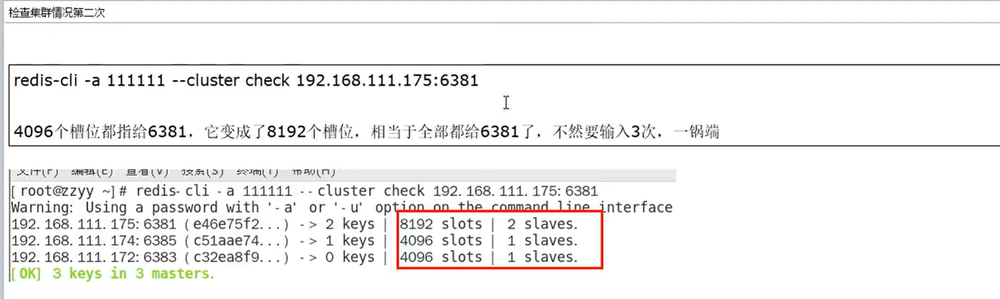


```
redis-cli -a 111111 --cluster del-node 192.168.111.100:6387 xxxxxxxxxxx(6387id)
```


```
redis-cli -a 111111 --cluster check 192.168.111.100:6381
```


## 9.4 总结：集群常用操作命令和CRC16算法分析

 


**==用{}设定key的分组，可让其存入同一个slot==**


查看当前槽是否有key


# 10、SpringBoot整合Redis


## 10.1 集成jedis


```xml
		<!--导入redis:jedis-->
        <dependency>
            <groupId>redis.clients</groupId>
            <artifactId>jedis</artifactId>
        </dependency>
```

写application.properties/yml

```
server.port=7777
spring.application.name=redis7_study
```


**==记得关闭linux防火墙：systemctl stop firewalld==**

**==还是连不上注意是不是linux不能上网，检查win + R，输入：services.msc ，启动VMware NAT Servise服务==**


## 10.2 集成lettuce


是线程安全的


```xml
		<!--导入redis：lettuce-->
        <dependency>
            <groupId>io.lettuce</groupId>
            <artifactId>lettuce-core</artifactId>
        </dependency>
```


## ==10.3 集成RedisTemplate==


### 连接单机


**改POM（最后附全部pom.xml内容）**


```xml
		<!--springboot与Redis整合依赖-->
        <!--redis：RedisTemplate(下面四个)-->
        <dependency>
            <groupId>org.springframework.boot</groupId>
            <artifactId>spring-boot-starter-data-redis</artifactId>
        </dependency>

        <dependency>
            <groupId>org.apache.commons</groupId>
            <artifactId>commons-pool2</artifactId>
        </dependency>

        <!--swagger2-->
        <dependency>
            <groupId>io.springfox</groupId>
            <artifactId>springfox-swagger2</artifactId>
            <version>2.9.2</version>
        </dependency>

        <dependency>
            <groupId>io.springfox</groupId>
            <artifactId>springfox-swagger-ui</artifactId>
            <version>2.9.2</version>
        </dependency>
```


**写application.properties/yml**


```properties
server.port=7777
spring.application.name=redis7_study

#========================logging=========================
logging.level.root=info
logging.level.com.spongehah.redis7=info
logging.pattern.console=%d{yyyy-MM-dd HH:mm:ss.SSS} [%thread] %-5level %logger- %msg%n 

logging.file.name=D:/mylogs2023/redis7_study.log
logging.pattern.file=%d{yyyy-MM-dd HH:mm:ss.SSS} [%thread] %-5level %logger- %msg%n

#=========================swagger==========================
#控制SwaggerConfig的enable的值
spring.swagger2.enabled=true
#springboot.2.6.X结合swagger2.9.X会提小documentationPluginsBootstrapper空指针异常，
#原因是在springboot2.6,X中将springMVC默认路径匹配策略从AntPathMatcher.更改为PathPatternParser,
#导致出错，解决办法是matching-strategy切换回，之前ant_path_matcher
spring.mvc.pathmatch.matching-strategy=ant_path_matcher

#==========================redis单机===========================
spring.redis.database=0
#修改为自己的真实IP
spring.redis.host=192.168.111.100
spring.redis.port=6379
spring.redis.password=xxxxxxxxxxxxxx@
spring.redis.lettuce.pool.max-active=8
spring.redis.lettuce.pool.max-wait=-1ms
spring.redis.lettuce.pool.max-idle=8
spring.redis.lettuce.pool.min-idle=0
```


**主启动类默认**


**业务类**


config.RedisConfig（解决了后面测试的序列化问题）

```java
@Configuration
public class RedisConfig
{
    /**
     * redis序列化的工具配置类，下面这个请一定开启配置
     * 127.0.0.1:6379> keys *
     * 1) "ord:102"  序列化过
     * 2) "\xac\xed\x00\x05t\x00\aord:102"   野生，没有序列化过
     * this.redisTemplate.opsForValue(); //提供了操作string类型的所有方法
     * this.redisTemplate.opsForList(); // 提供了操作list类型的所有方法
     * this.redisTemplate.opsForSet(); //提供了操作set的所有方法
     * this.redisTemplate.opsForHash(); //提供了操作hash表的所有方法
     * this.redisTemplate.opsForZSet(); //提供了操作zset的所有方法
     * @param lettuceConnectionFactory
     * @return
     */
    @Bean
    public RedisTemplate<String, Object> redisTemplate(LettuceConnectionFactory lettuceConnectionFactory)
    {
        RedisTemplate<String,Object> redisTemplate = new RedisTemplate<>();

        redisTemplate.setConnectionFactory(lettuceConnectionFactory);
        //设置key序列化方式string
        redisTemplate.setKeySerializer(new StringRedisSerializer());
        //设置value的序列化方式json，使用GenericJackson2JsonRedisSerializer替换默认序列化
        redisTemplate.setValueSerializer(new GenericJackson2JsonRedisSerializer());

        redisTemplate.setHashKeySerializer(new StringRedisSerializer());
        redisTemplate.setHashValueSerializer(new GenericJackson2JsonRedisSerializer());

        redisTemplate.afterPropertiesSet();

        return redisTemplate;
    }
}
```

config.SwaggerConfig

```java
@Configuration
@EnableSwagger2
public class SwaggerConfig
{
    @Value("${spring.swagger2.enabled}")
    private Boolean enabled;

    @Bean
    public Docket createRestApi() {
        return new Docket(DocumentationType.SWAGGER_2)
                .apiInfo(apiInfo())
                .enable(enabled)
                .select()
                .apis(RequestHandlerSelectors.basePackage("com.spongehah.redis7")) //你自己的package
                .paths(PathSelectors.any())
                .build();
    }
    public ApiInfo apiInfo() {
        return new ApiInfoBuilder()
                .title("springboot利用swagger2构建api接口文档 "+"\t"+ DateTimeFormatter.ofPattern("yyyy-MM-dd").format(LocalDateTime.now()))
                .description("springboot+redis整合,有问题给管理员阳哥邮件:zzyybs@126.com")
                .version("1.0")
                .termsOfServiceUrl("https://www.atguigu.com/")
                .build();
    }
}
```


service.OrderService

```java
@Service
@Slf4j
public class OrderService {
    public static final String ORDER_KEY = "ord:";
    
    @Resource
    private RedisTemplate redisTemplate;
//    private StringRedisTemplate stringRedisTemplate;
    
    public void addOrder(){
        int keyId = ThreadLocalRandom.current().nextInt(1000)+1;
        String serialNo = UUID.randomUUID().toString();
        
        String key = ORDER_KEY+keyId;
        String value = "京东订单" + serialNo;
        
        redisTemplate.opsForValue().set(key,value);
//        stringRedisTemplate.opsForValue().set(key,value);
        
        log.info("***key:{}",key);
        log.info("***value:{}",value);
    }
    
    public String getOrderById(Integer keyId){
        return (String) redisTemplate.opsForValue().get(ORDER_KEY + keyId);
//        return  stringRedisTemplate.opsForValue().get(ORDER_KEY + keyId);
    }
}

```


controller.OrderController

```java
@RestController
@Slf4j
@Api(tags = "订单接口")
public class OrderController {
    @Resource
    private OrderService orderService;
    
    @ApiOperation("新增订单")
    @RequestMapping(value = "/order/add",method = RequestMethod.POST)
    public void addOrder(){
        orderService.addOrder();
    }
    
    @ApiOperation("按照keyId查询订单")
    @RequestMapping(value = "/order/{keyId}",method = RequestMethod.GET)
    public void getOrderById(@PathVariable Integer keyId){
        orderService.getOrderById(keyId);
    }
}
```


**测试**


http://localhost:7777/swagger-ui.html#/

**序列化问题**


第一种方案：

将OrderService类中的RedisTemplate改为其子类StringRedisTemplate,此时swagger和浏览器中显示正常，若要在redis客户端中正常显示中文，redis-cli命令需要加上--raw


==第二种方案：（推荐）==

配置好RedisConfig类


### 连接集群


# POM.xml

```xml
<?xml version="1.0" encoding="UTF-8"?>
<project xmlns="http://maven.apache.org/POM/4.0.0"
         xmlns:xsi="http://www.w3.org/2001/XMLSchema-instance"
         xsi:schemaLocation="http://maven.apache.org/POM/4.0.0 http://maven.apache.org/xsd/maven-4.0.0.xsd">
    <modelVersion>4.0.0</modelVersion>

    <groupId>com.atguigu.redis7</groupId>
    <artifactId>redis7_study</artifactId>
    <version>1.0-SNAPSHOT</version>

    <parent>
        <groupId>org.springframework.boot</groupId>
        <artifactId>spring-boot-starter-parent</artifactId>
        <version>2.6.10</version>
        <relativePath/>
    </parent>

    <properties>
        <project.build.sourceEncoding>UTF-8</project.build.sourceEncoding>
        <maven.compiler.source>1.8</maven.compiler.source>
        <maven.compiler.target>1.8</maven.compiler.target>
        <junit.version>4.12</junit.version>
        <log4j.version>1.2.17</log4j.version>
        <lombok.version>1.16.18</lombok.version>
    </properties>

    <dependencies>
        <!--guava Google 开源的 Guava 中自带的布隆过滤器-->
        <dependency>
            <groupId>com.google.guava</groupId>
            <artifactId>guava</artifactId>
            <version>23.0</version>
        </dependency>
        <!--SpringBoot通用依赖模块-->
        <dependency>
            <groupId>org.springframework.boot</groupId>
            <artifactId>spring-boot-starter-web</artifactId>
        </dependency>
        <!--jedis-->
        <dependency>
            <groupId>redis.clients</groupId>
            <artifactId>jedis</artifactId>
            <version>4.3.1</version>
        </dependency>
        <!--lettuce-->
        <!--<dependency>
            <groupId>io.lettuce</groupId>
            <artifactId>lettuce-core</artifactId>
            <version>6.2.1.RELEASE</version>
        </dependency>-->
        <!--SpringBoot与Redis整合依赖-->
        <dependency>
            <groupId>org.springframework.boot</groupId>
            <artifactId>spring-boot-starter-data-redis</artifactId>
        </dependency>
        <dependency>
            <groupId>org.apache.commons</groupId>
            <artifactId>commons-pool2</artifactId>
        </dependency>
        <!--swagger2-->
        <dependency>
            <groupId>io.springfox</groupId>
            <artifactId>springfox-swagger2</artifactId>
            <version>2.9.2</version>
        </dependency>
        <dependency>
            <groupId>io.springfox</groupId>
            <artifactId>springfox-swagger-ui</artifactId>
            <version>2.9.2</version>
        </dependency>
        <!--Mysql数据库驱动-->
        <dependency>
            <groupId>mysql</groupId>
            <artifactId>mysql-connector-java</artifactId>
            <version>5.1.47</version>
        </dependency>
        <!--SpringBoot集成druid连接池-->
        <dependency>
            <groupId>com.alibaba</groupId>
            <artifactId>druid-spring-boot-starter</artifactId>
            <version>1.1.10</version>
        </dependency>
        <dependency>
            <groupId>com.alibaba</groupId>
            <artifactId>druid</artifactId>
            <version>1.1.16</version>
        </dependency>
        <!--mybatis和springboot整合-->
        <dependency>
            <groupId>org.mybatis.spring.boot</groupId>
            <artifactId>mybatis-spring-boot-starter</artifactId>
            <version>1.3.0</version>
        </dependency>
        <!--hutool-->
        <dependency>
            <groupId>cn.hutool</groupId>
            <artifactId>hutool-all</artifactId>
            <version>5.2.3</version>
        </dependency>
        <!--persistence-->
        <dependency>
            <groupId>javax.persistence</groupId>
            <artifactId>persistence-api</artifactId>
            <version>1.0.2</version>
        </dependency>
        <!--通用Mapper-->
        <dependency>
            <groupId>tk.mybatis</groupId>
            <artifactId>mapper</artifactId>
            <version>4.1.5</version>
        </dependency>
        <dependency>
            <groupId>org.springframework.boot</groupId>
            <artifactId>spring-boot-autoconfigure</artifactId>
        </dependency>
        <!--通用基础配置junit/devtools/test/log4j/lombok/-->
        <dependency>
            <groupId>junit</groupId>
            <artifactId>junit</artifactId>
            <version>${junit.version}</version>
        </dependency>
        <dependency>
            <groupId>org.springframework.boot</groupId>
            <artifactId>spring-boot-starter-test</artifactId>
            <scope>test</scope>
        </dependency>
        <dependency>
            <groupId>log4j</groupId>
            <artifactId>log4j</artifactId>
            <version>${log4j.version}</version>
        </dependency>
        <dependency>
            <groupId>org.projectlombok</groupId>
            <artifactId>lombok</artifactId>
            <version>${lombok.version}</version>
            <optional>true</optional>
        </dependency>
    </dependencies>

    <build>
        <plugins>
            <plugin>
                <groupId>org.springframework.boot</groupId>
                <artifactId>spring-boot-maven-plugin</artifactId>
            </plugin>
        </plugins>
    </build>

</project>


```

​	
